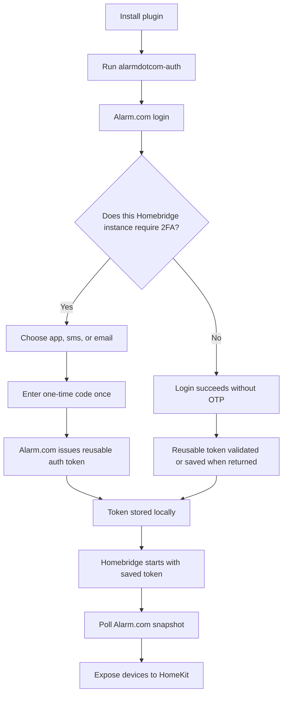

# Alarm.com Next for Homebridge

Unofficial Homebridge platform plugin for Alarm.com.

This plugin is built around a reusable Alarm.com auth token instead of the older "copy a browser MFA cookie into config" workflow. You authenticate once with `alarmdotcom-auth`, save the token locally, and Homebridge reuses that token for normal polling and device control.

`homebridge-alarm.com-next` is intentionally separate from `homebridge-alarmdotcom` and uses the Homebridge platform name `AlarmdotcomNext`.

## Why this plugin

- No manual browser-cookie extraction.
- One-time enrollment for accounts that require 2FA.
- Works for accounts that do not currently require 2FA too.
- Stores the reusable auth token in Homebridge storage by default.
- Supports importing an existing Alarm.com auth token.
- Exposes Alarm.com panels, sensors, locks, lights, garage doors, gates, and thermostats to HomeKit.

## Auth flow



With 2FA enabled, the one-time code step only happens during enrollment or after Alarm.com revokes the trusted device state. If your Alarm.com account does not currently require 2FA, the same helper still works. 2FA is strongly recommended.

## Old flow vs this plugin

| Topic | Older cookie-based flow | This plugin |
| --- | --- | --- |
| Initial setup | Sign in through a browser and extract MFA cookies manually | Run `alarmdotcom-auth` once |
| 2FA handling | Cookie often had to be copied again after expiry or reset | Complete 2FA once, save reusable token |
| Homebridge config | Sensitive browser cookie pasted into config | Optional token path or token import |
| No-2FA accounts | Usually still browser-session oriented | Direct login still works |
| Operational model | Browser-session dependent | Token-file based |

## Supported HomeKit accessories

| Alarm.com device | HomeKit service | Notes |
| --- | --- | --- |
| Security panels / partitions | `SecuritySystem` | Supports disarm, stay, away, and night arming |
| Contact sensors | `ContactSensor` | Door / window style sensors |
| Motion sensors | `MotionSensor` | Includes panel motion devices when exposed by Alarm.com |
| Leak / water sensors | `LeakSensor` | Wet / dry style state mapping |
| Smoke sensors | `SmokeSensor` | Triggered state maps to smoke detected |
| Carbon monoxide sensors | `CarbonMonoxideSensor` | Triggered state maps to abnormal CO levels |
| Glass-break / shock sensors | `ContactSensor` | HomeKit has no first-class glass-break service, so these are currently exposed as contact-style sensors |
| Locks | `LockMechanism` | Includes battery-low and fault state reporting when available |
| Lights | `Lightbulb` | On / off |
| Dimmers | `Lightbulb` | Brightness supported |
| Garage doors | `GarageDoorOpener` | Open / close |
| Gates | `GarageDoorOpener` | Exposed with the closest HomeKit service |
| Thermostats | `Thermostat` | Current temp, target temp, HVAC mode, and humidity when reported |

Battery-low and general fault state reporting are surfaced where Alarm.com provides that information.

## Known gaps

- Full Homebridge-as-TV enrollment is not complete yet. The repo can approve an existing Alarm.com linked-device activation code, but it does not yet mint its own six-digit `alarm.com/ActivateTV` code.
- Some Alarm.com sensor categories do not map cleanly to HomeKit and are intentionally skipped.
- Freeze, panic, mobile-phone, and image-style device types are not currently exposed as HomeKit accessories.

## Install in Homebridge

### 1. Remove the conflicting plugin

If `homebridge-alarmdotcom` is already installed, remove it first so Homebridge only loads one Alarm.com package:

```bash
sudo npm uninstall -g homebridge-alarmdotcom
```

If you installed it from the Homebridge UI, remove it there instead.

### 2. Install this plugin

#### Current install path: GitHub

This is the current recommended install path:

```bash
sudo npm install -g github:ezefranca/alarm.com
```

#### Local install from this repo

Use this only when Homebridge runs on the same machine where you are developing the plugin:

```bash
cd /path/to/alarm.com
npm install
sudo npm install -g .
```

#### Install from npm

Use this after the package is published to npm:

```bash
sudo npm install -g homebridge-alarm.com-next
```

### 3. Enroll or validate the auth token

Standard enrollment:

```bash
alarmdotcom-auth --username you@example.com
```

The helper will:

- log in with your Alarm.com username and password
- detect whether Alarm.com requires 2FA for this Homebridge instance
- let you choose `app`, `sms`, or `email`
- verify the one-time code when required
- save the returned token to `~/.homebridge/alarmdotcom-auth.json` by default

If your Alarm.com account does not prompt for 2FA, the helper still works and continues with the non-OTP login path.

### 4. Add the Homebridge platform config

Use the `AlarmdotcomNext` platform name:

```json
{
  "platform": "AlarmdotcomNext",
  "name": "Alarm.com Next",
  "username": "you@example.com",
  "password": "super-secret-password",
  "authToken": "",
  "pollIntervalSeconds": 60,
  "authTimeoutMinutes": 10,
  "tokenPath": "/var/lib/homebridge/alarmdotcom-auth.json",
  "ignoredDevices": [],
  "logLevel": "info",
  "armingModes": {
    "away": {
      "noEntryDelay": false,
      "silentArming": false,
      "nightArming": false,
      "forceBypass": false
    },
    "stay": {
      "noEntryDelay": false,
      "silentArming": false,
      "nightArming": false,
      "forceBypass": false
    },
    "night": {
      "noEntryDelay": false,
      "silentArming": false,
      "nightArming": true,
      "forceBypass": false
    }
  }
}
```

### 5. Restart Homebridge

After the config is saved, restart Homebridge so the plugin can log in and expose the Alarm.com devices to HomeKit.

## Homebridge on another machine

If the Homebridge server is not the machine where you are editing this repo, do the install and auth steps on the Homebridge server itself:

```bash
sudo npm install -g github:ezefranca/alarm.com
alarmdotcom-auth --username you@example.com
```

That matters because the saved auth token file is local to the machine where `alarmdotcom-auth` runs. If you authenticate on one machine and Homebridge runs on another, you must either:

1. Copy the token file to the Homebridge machine.
2. Or point both the CLI and the plugin at the same shared file with `--token-file` and `tokenPath`.

## Auth helper examples

Standard enrollment:

```bash
alarmdotcom-auth --username you@example.com
```

Pick a specific 2FA method up front:

```bash
alarmdotcom-auth --username you@example.com --method app
```

Import and validate an existing Alarm.com auth token:

```bash
alarmdotcom-auth --username you@example.com --auth-token YOUR_TOKEN_VALUE
```

Approve an existing linked-device activation code:

```bash
alarmdotcom-auth --username you@example.com --device-link-code 123456
```

Use a custom token file:

```bash
alarmdotcom-auth --username you@example.com --token-file /path/to/alarmdotcom-auth.json
```

Show debug output:

```bash
alarmdotcom-auth --username you@example.com --debug
```

## Configuration reference

| Key | Required | Default | Meaning |
| --- | --- | --- | --- |
| `platform` | yes | none | Must be `AlarmdotcomNext` |
| `name` | no | `Alarm.com Next` | Display name inside Homebridge |
| `username` | yes | none | Alarm.com username |
| `password` | yes | none | Alarm.com password |
| `authToken` | no | empty | Optional reusable Alarm.com token pasted directly into config |
| `tokenPath` | no | Homebridge storage + `alarmdotcom-auth.json` | Override token file location |
| `pollIntervalSeconds` | no | `60` | Device refresh interval, minimum `30` |
| `authTimeoutMinutes` | no | `10` | Session refresh interval |
| `logLevel` | no | `info` | One of `debug`, `info`, `warn`, `error` |
| `ignoredDevices` | no | `[]` | Alarm.com device IDs to hide from HomeKit |
| `armingModes.*` | no | built in | Per-mode arming flags for stay / away / night |

## Operational notes

- Polling is intentionally conservative. The default is 60 seconds.
- If Alarm.com resets 2FA, revokes trusted devices, or invalidates the stored token, rerun `alarmdotcom-auth`.
- Leaving `tokenPath` empty uses the Homebridge storage directory automatically. That is the recommended setup.
- If `alarmdotcom-auth` appears to pause after the password prompt, run it again with `--debug` for clearer login-step output.
- If you were using an older local build of this repo, update the Homebridge platform name from `Alarmdotcom` to `AlarmdotcomNext`.

## Verification readiness

This repo is prepared for Homebridge verification work, but the badge will remain orange until the Homebridge team reviews and approves it.

Current repo-side readiness items:

- Homebridge settings UI is implemented through `config.schema.json`
- no post-install scripts are used
- no analytics or telemetry are present
- auth-token storage defaults to the Homebridge storage directory
- CI runs `npm ci`, `npm run check`, `npm test`, and `npm pack --dry-run` on Node 20, 22, and 24
- publish workflow is prepared for npm releases using `NPM_TOKEN`

Remaining external steps:

1. Publish `homebridge-alarm.com-next` to npm.
2. Push the repo to GitHub with issues enabled.
3. Create GitHub releases for published versions, with release notes.
4. Open a verification request issue in the Homebridge plugins repository.

## Research references

- Alarm.com linked devices: https://answers.alarm.com/Partner/Installation_and_Troubleshooting/Website_and_Apps/General_Website_and_Apps_Information/Linked_Devices
- Alarm.com TV activation page: https://www.alarm.com/ActivateTV
- Alarm.com Video for TV overview: https://answers.alarm.com/Partner/Installation_and_Troubleshooting/Website_and_Apps/Alarm.com_Video_for_TV
- Existing Homebridge implementation that relied on manual MFA cookies: https://github.com/node-alarm-dot-com/homebridge-node-alarm-dot-com
- Maintained Home Assistant integration using Alarm.com login and trusted-device APIs: https://github.com/pyalarmdotcom/alarmdotcom
